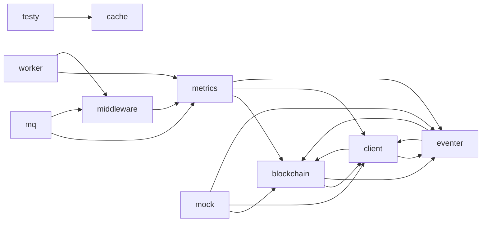

# Dependency Graph

<!-- sdd-knowledge-generated -->

## Feature Dependencies

## External Dependencies

| Package | Import Count |
|---------|--------------|
| `github.com` | 88 |
| `gorm.io` | 9 |
| `golang.org` | 5 |
| `gotest.tools` | 3 |

## See Also
- [logging](../features/logging.md) <!-- rel:strong -->
- [gin](../features/gin.md) <!-- rel:strong -->
- [worker](../features/worker.md) <!-- rel:strong -->
- [httplib](../features/httplib.md) <!-- rel:strong -->
- [slice](../features/slice.md) <!-- rel:strong -->
