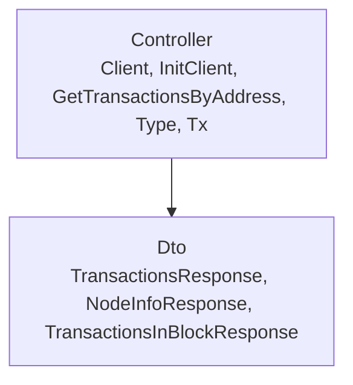
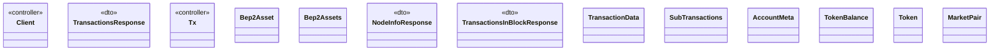

# Blockchain

<!-- sdd-knowledge-generated -->

## Overview

- **Files**: 6
- **Symbols**: 30
- **DTOs**: TransactionsResponse, NodeInfoResponse, TransactionsInBlockResponse
- **Controllers**: Client, InitClient, GetTransactionsByAddress, Type, Tx

## Files

- `blockchain/binance/api/client.go` — Client, InitClient, GetTransactionsByAddress
- `blockchain/binance/api/model.go` — TransactionsResponse, Type, Tx
- `blockchain/binance/client.go` — Client, InitClient, FetchNodeInfo, FetchTransactionsInBlock, FetchTransactionsByAddressAndTokenID, FetchAccountMeta, FetchTokens, FetchMarketPairs
- `blockchain/binance/explorer/client.go` — Client, InitClient, FetchBep2Assets
- `blockchain/binance/explorer/model.go` — Bep2Asset, Bep2Assets
- `blockchain/binance/model.go` — NodeInfoResponse, TransactionsInBlockResponse, TxType, Tx, TransactionData, SubTransactions, AccountMeta, TokenBalance, Tokens, Token, MarketPair

## Architecture

### Layers

**Controller**: `Client`, `InitClient`, `GetTransactionsByAddress`, `Type`, `Tx`

**Dto**: `TransactionsResponse`, `NodeInfoResponse`, `TransactionsInBlockResponse`

**Other**: `Client`, `InitClient`, `FetchNodeInfo`, `FetchTransactionsInBlock`, `FetchTransactionsByAddressAndTokenID`, `FetchAccountMeta`, `FetchTokens`, `FetchMarketPairs`, `Client`, `InitClient`, `FetchBep2Assets`, `Bep2Asset`, `Bep2Assets`, `TxType`, `Tx`, `TransactionData`, `SubTransactions`, `AccountMeta`, `TokenBalance`, `Tokens`, `Token`, `MarketPair`

### Data Flow

## Class Diagram

## Minimum Viable Specification

> Auto-generated specification for the **Blockchain** feature.

**Contracts**: TransactionsResponse, NodeInfoResponse, TransactionsInBlockResponse

**Key Types**: Client, TransactionsResponse, Tx, Client, Client, Bep2Asset, Bep2Assets, NodeInfoResponse, TransactionsInBlockResponse, Tx, TransactionData, SubTransactions, AccountMeta, TokenBalance, Token, MarketPair

