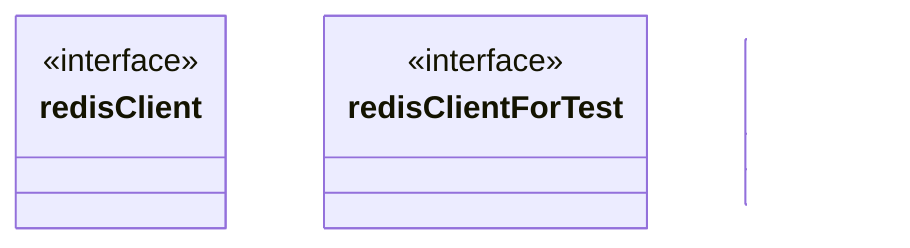

# Cache

<!-- sdd-knowledge-generated -->

## Overview

- **Files**: 3
- **Symbols**: 27

## Files

- `cache/redis/client_interface.go` — redisClient, redisClientForTest
- `cache/redis/redis_test.go`
- `cache/redis/redis.go` — Redis, Option, ClusterOption, WithTLS, WithClusterTLS, InitWithTLS, Init, InitClusterWithTLS, InitCluster, Get, GetBytes, MGet, Scan, Set, SetBytes, MSet, Delete, Watch, IsAvailable, Reconnect, SetNX, SetXX, reconnectCluster, Close, HealthCheck

## Class Diagram

## External Dependencies

- `github.com`

## Minimum Viable Specification

> Auto-generated specification for the **Cache** feature.

**Key Types**: redisClient, redisClientForTest, Redis

