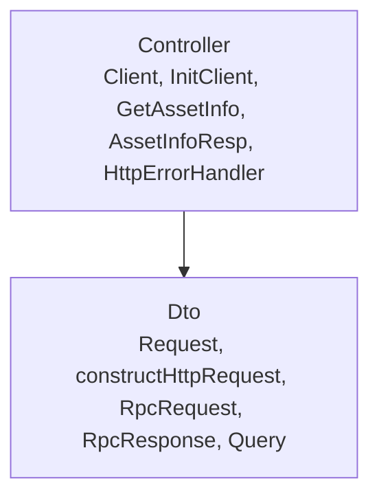
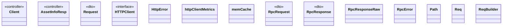

# Client

<!-- sdd-knowledge-generated -->

## Overview

- **Files**: 19
- **Symbols**: 89
- **DTOs**: Request, constructHttpRequest, RpcRequest, RpcResponse, Query
- **Controllers**: Client, InitClient, GetAssetInfo, AssetInfoResp, HttpErrorHandler

## Files

- `client/api/backend/client.go` — Client, InitClient, GetAssetInfo
- `client/api/backend/model.go` — AssetInfoResp
- `client/client_execute.go` — Execute, constructHttpRequest, reportMonitoringMetricsIfEnabled, setRequestHeaders, populateResultContainer, getMonitoredPathTemplateIfEnabled, GetBase, GetURL, metricsEnabled, GetBody
- `client/client_metrics_test.go`
- `client/client_metrics.go` — httpClientMetrics, newHttpClientMetrics, observeDuration, observeResult, Describe, Collect, getHttpRespMetricStatus
- `client/client_test.go`
- `client/client_wrapper_test.go`
- `client/client_wrapper.go` — GetWithContext, Get, Post, GetRaw, PostRaw, PostWithContext
- `client/client.go` — Request, HTTPClient, HttpError, Error, HttpErrorHandler, Option, InitClient, InitJSONClient, TimeoutOption, ProxyOption, WithHttpClient, WithExtraHeader, WithHost, WithExtraHeaders, WithMetricsEnabled, SetTimeout, SetProxy, AddHeader, setHttpClientTransportProxy
- `client/clientcache_test.go`
- `client/clientcache.go` — init, memCache, PostWithCache, PostWithCacheAndContext, GetWithCache, GetWithCacheAndContext, setCache, getCache, generateKey
- `client/jsonrpc_batch_test.go`
- `client/jsonrpc_batch.go` — RpcRequestMapper, MakeBatchRequests, MakeBatches
- `client/jsonrpc_test.go`
- `client/jsonrpc.go` — RpcRequests, RpcRequest, RpcResponse, RpcResponseRaw, RpcError, RpcCall, RpcCallRaw, RpcBatchCall, Error, GetObject, fillDefaultValues, genID
- `client/path_test.go`
- `client/path.go` — Path, NewStaticPath, NewEmptyPath, NewPath, String
- `client/request_test.go`
- `client/request.go` — Req, ReqBuilder, NewReqBuilder, Headers, WriteTo, WriteRawResponseTo, Method, PathStatic, Pathf, Query, Body, MetricName, pathMetricEnabled, Build

## Architecture

### Layers

**Controller**: `Client`, `InitClient`, `GetAssetInfo`, `AssetInfoResp`, `HttpErrorHandler`

**Dto**: `Request`, `constructHttpRequest`, `RpcRequest`, `RpcResponse`, `Query`

**Other**: `HTTPClient`, `HttpError`, `Error`, `Option`, `InitClient`, `InitJSONClient`, `TimeoutOption`, `ProxyOption`, `WithHttpClient`, `WithExtraHeader`, `WithHost`, `WithExtraHeaders`, `WithMetricsEnabled`, `SetTimeout`, `SetProxy`, `AddHeader`, `setHttpClientTransportProxy`, `Execute`, `reportMonitoringMetricsIfEnabled`, `setRequestHeaders`, `populateResultContainer`, `getMonitoredPathTemplateIfEnabled`, `GetBase`, `GetURL`, `metricsEnabled`, `GetBody`, `httpClientMetrics`, `newHttpClientMetrics`, `observeDuration`, `observeResult`, `Describe`, `Collect`, `getHttpRespMetricStatus`, `GetWithContext`, `Get`, `Post`, `GetRaw`, `PostRaw`, `PostWithContext`, `init`, `memCache`, `PostWithCache`, `PostWithCacheAndContext`, `GetWithCache`, `GetWithCacheAndContext`, `setCache`, `getCache`, `generateKey`, `RpcRequests`, `RpcResponseRaw`, `RpcError`, `RpcCall`, `RpcCallRaw`, `RpcBatchCall`, `Error`, `GetObject`, `fillDefaultValues`, `genID`, `RpcRequestMapper`, `MakeBatchRequests`, `MakeBatches`, `Path`, `NewStaticPath`, `NewEmptyPath`, `NewPath`, `String`, `Req`, `ReqBuilder`, `NewReqBuilder`, `Headers`, `WriteTo`, `WriteRawResponseTo`, `Method`, `PathStatic`, `Pathf`, `Body`, `MetricName`, `pathMetricEnabled`, `Build`

### Data Flow

## Class Diagram

## External Dependencies

- `github.com`

## Minimum Viable Specification

> Auto-generated specification for the **Client** feature.

**Contracts**: Request, constructHttpRequest, RpcRequest, RpcResponse, Query

**Key Types**: Client, AssetInfoResp, Request, HTTPClient, HttpError, httpClientMetrics, memCache, RpcRequest, RpcResponse, RpcResponseRaw, RpcError, Path, Req, ReqBuilder

