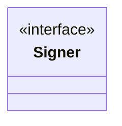

# Crypto

<!-- sdd-knowledge-generated -->

## Overview

- **Files**: 4
- **Symbols**: 12

## Files

- `crypto/aes_test.go`
- `crypto/aes.go` — AESEncrypt, AESDecrypt
- `crypto/sign_test.go`
- `crypto/sign.go` — Signer, SignFunc, Sign, NewSHA256WithRSASigner, NewHMACSHA256Signer, SHA256WithRSA, HMACSHA256, GetRSAPrivateKey, GetRSAPrivateKeyFromFile, GetRSAPrivateKeyFromString

## Class Diagram

## External Dependencies

- `github.com`

## Minimum Viable Specification

> Auto-generated specification for the **Crypto** feature.

**Key Types**: Signer

## See Also
- [config](../libs/config.md) <!-- rel:strong -->
- [call graph](../architecture/call-graph.md) <!-- rel:related -->
- [dependency graph](../architecture/dependency-graph.md) <!-- rel:related -->
- [crypto and auth](../security/crypto-and-auth.md) <!-- rel:related -->
- [project structure](../architecture/project-structure.md) <!-- rel:related -->
