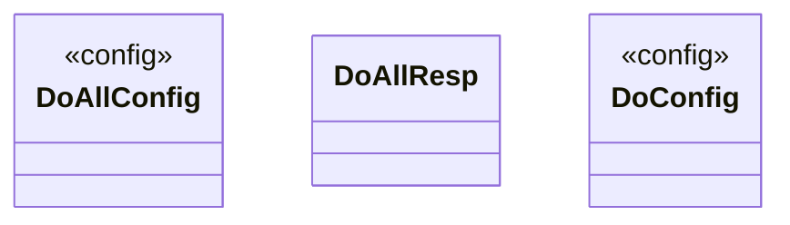

# Ctask

<!-- sdd-knowledge-generated -->

## Overview

- **Files**: 4
- **Symbols**: 11

## Files

- `ctask/do_all_test.go`
- `ctask/do_all.go` — DoAllOpt, DoAllConfig, DoAllResp, DoAll, getDoAllConfigWithOptions, WithDoAllWorkerNum
- `ctask/doer_test.go`
- `ctask/doer.go` — DoOpt, DoConfig, Do, getConfigWithOptions, WithWorkerNum

## Architecture

### Layers

**Config**: `DoAllConfig`, `getDoAllConfigWithOptions`, `DoConfig`, `getConfigWithOptions`

**Other**: `DoAllOpt`, `DoAllResp`, `DoAll`, `WithDoAllWorkerNum`, `DoOpt`, `Do`, `WithWorkerNum`

## Class Diagram

## External Dependencies

- `github.com`
- `golang.org`

## Minimum Viable Specification

> Auto-generated specification for the **Ctask** feature.

**Key Types**: DoAllConfig, DoAllResp, DoConfig

## See Also
- [config](../libs/config.md) <!-- rel:strong -->
- [dependency graph](../architecture/dependency-graph.md) <!-- rel:strong -->
- [call graph](../architecture/call-graph.md) <!-- rel:strong -->
- [overview](../architecture/overview.md) <!-- rel:strong -->
- [models](../architecture/data/models.md) <!-- rel:strong -->
