# Database

<!-- sdd-knowledge-generated -->

## Overview

- **Files**: 5
- **Symbols**: 54

## Files

- `database/config.go` — LogLevel, newLogLevelFromString, DBConnPool, DBConfig, applyDefaultValue
- `database/db.go` — DBContextGetter, TrxContextGetter, transactionKey, DBGetter, NewDBGetter, NewDBGetterFromGormInstance, GetSourceDB, HealthCheck, DBFrom, Transaction, Close
- `database/migrate.go` — operationFn, OperationData, MigrationRunner, Option, WithLogger, WithFilesDir, NewMigrationRunner, Run, Version, runUp, runDown, runForce, logger, noopLogger, Info, Error, Printf, Verbose, toMigrationsLogger, migrationsLogger, Printf, Verbose, Info, Error
- `database/migration_runner_env.go` — readForceVersion, RunMigrationsFromEnv
- `database/mock_db.go` — MockDBContextGetter, MockDBContextGetterMockRecorder, NewMockDBContextGetter, EXPECT, DBFrom, DBFrom, MockTrxContextGetter, MockTrxContextGetterMockRecorder, NewMockTrxContextGetter, EXPECT, Transaction, Transaction

## Architecture

### Layers

**Config**: `DBConfig`

**Other**: `LogLevel`, `newLogLevelFromString`, `DBConnPool`, `applyDefaultValue`, `DBContextGetter`, `TrxContextGetter`, `transactionKey`, `DBGetter`, `NewDBGetter`, `NewDBGetterFromGormInstance`, `GetSourceDB`, `HealthCheck`, `DBFrom`, `Transaction`, `Close`, `operationFn`, `OperationData`, `MigrationRunner`, `Option`, `WithLogger`, `WithFilesDir`, `NewMigrationRunner`, `Run`, `Version`, `runUp`, `runDown`, `runForce`, `logger`, `noopLogger`, `Info`, `Error`, `Printf`, `Verbose`, `toMigrationsLogger`, `migrationsLogger`, `Printf`, `Verbose`, `Info`, `Error`, `readForceVersion`, `RunMigrationsFromEnv`, `MockDBContextGetter`, `MockDBContextGetterMockRecorder`, `NewMockDBContextGetter`, `EXPECT`, `DBFrom`, `DBFrom`, `MockTrxContextGetter`, `MockTrxContextGetterMockRecorder`, `NewMockTrxContextGetter`, `EXPECT`, `Transaction`, `Transaction`

## Class Diagram

```mermaid
classDiagram
  class DBConnPool {
  }
  class DBConfig {
    <<config>>
  }
  class DBContextGetter {
    <<interface>>
  }
  class TrxContextGetter {
    <<interface>>
  }
  class transactionKey {
  }
  class DBGetter {
  }
  class OperationData {
  }
  class MigrationRunner {
  }
  class logger {
    <<interface>>
  }
  class noopLogger {
  }
  class migrationsLogger {
  }
  class MockDBContextGetter {
  }
  class MockDBContextGetterMockRecorder {
  }
  class MockTrxContextGetter {
  }
  class MockTrxContextGetterMockRecorder {
  }
```

## External Dependencies

- `github.com`
- `gorm.io`

## Minimum Viable Specification

> Auto-generated specification for the **Database** feature.

**Key Types**: DBConnPool, DBConfig, DBContextGetter, TrxContextGetter, transactionKey, DBGetter, OperationData, MigrationRunner, logger, noopLogger, migrationsLogger, MockDBContextGetter, MockDBContextGetterMockRecorder, MockTrxContextGetter, MockTrxContextGetterMockRecorder

