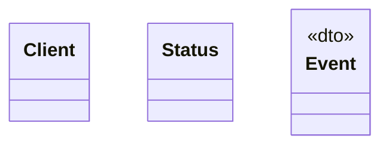

# Eventer

<!-- sdd-knowledge-generated -->

## Overview

- **Files**: 2
- **Symbols**: 7
- **DTOs**: Event

## Files

- `eventer/client.go` — Client, Status, Event, Init, SendBatch
- `eventer/log.go` — Log, sendEvents

## Architecture

### Layers

**Dto**: `Event`

**Other**: `Client`, `Status`, `Init`, `SendBatch`, `Log`, `sendEvents`

## Class Diagram

## External Dependencies

- `github.com`

## Minimum Viable Specification

> Auto-generated specification for the **Eventer** feature.

**Contracts**: Event

**Key Types**: Client, Status, Event

