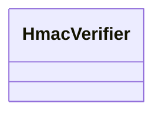

# Gin

<!-- sdd-knowledge-generated -->

## Overview

- **Files**: 3
- **Symbols**: 10
- **Controllers**: SignedHandler

## Files

- `gin/hmac_test.go`
- `gin/hmac.go` — StrFromCtx, HmacVerifier, NewHmacVerifier, WithHmacVerifierSigKeys, WithHmacVerifierSigFunction, WithHmacVerifierSigEncoder, SignedHandler, verifySignature
- `gin/setup.go` — SetupGracefulShutdown, SetupGracefulServeWithUnixFile

## Architecture

### Layers

**Controller**: `SignedHandler`

**Other**: `StrFromCtx`, `HmacVerifier`, `NewHmacVerifier`, `WithHmacVerifierSigKeys`, `WithHmacVerifierSigFunction`, `WithHmacVerifierSigEncoder`, `verifySignature`, `SetupGracefulShutdown`, `SetupGracefulServeWithUnixFile`

## Class Diagram

## External Dependencies

- `github.com`
- `gotest.tools`

## Minimum Viable Specification

> Auto-generated specification for the **Gin** feature.

**Key Types**: HmacVerifier

## See Also
- [dependency graph](../architecture/dependency-graph.md) <!-- rel:strong -->
- [config](../libs/config.md) <!-- rel:strong -->
- [call graph](../architecture/call-graph.md) <!-- rel:related -->
- [models](../architecture/data/models.md) <!-- rel:related -->
- [layers](../architecture/layers.md) <!-- rel:related -->
