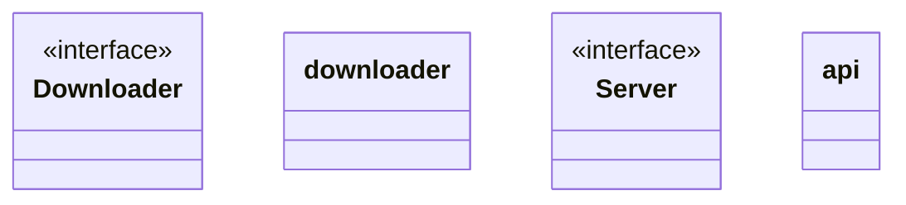

# Httplib

<!-- sdd-knowledge-generated -->

## Overview

- **Files**: 2
- **Symbols**: 13

## Files

- `httplib/downloader.go` — Downloader, downloader, Download, DownloaderOption, NewDownloader, DownloaderOptionBytesSizeLimit, DownloaderOptionHttpClient
- `httplib/server.go` — Server, api, NewHTTPServer, NewH2CServer, Run, serve

## Class Diagram

## External Dependencies

- `github.com`
- `golang.org`

## Minimum Viable Specification

> Auto-generated specification for the **Httplib** feature.

**Key Types**: Downloader, downloader, Server, api

## See Also
- [dependency graph](../architecture/dependency-graph.md) <!-- rel:strong -->
- [config](../libs/config.md) <!-- rel:strong -->
- [overview](../architecture/overview.md) <!-- rel:related -->
- [call graph](../architecture/call-graph.md) <!-- rel:related -->
- [project structure](../architecture/project-structure.md) <!-- rel:related -->
