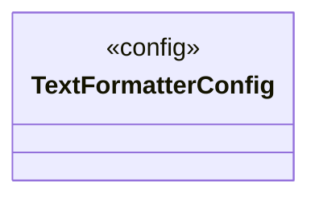

# Logging

<!-- sdd-knowledge-generated -->

## Overview

- **Files**: 3
- **Symbols**: 9

## Files

- `logging/formatter_strict_text.go` — TextFormatterConfig, init, NewTextFormatter
- `logging/logger_test.go`
- `logging/logger.go` — Config, init, SetLoggerConfig, GetLogger, GetLoggerForComponent, SetLogger

## Architecture

### Layers

**Config**: `TextFormatterConfig`, `Config`, `SetLoggerConfig`

**Other**: `init`, `NewTextFormatter`, `init`, `GetLogger`, `GetLoggerForComponent`, `SetLogger`

## Class Diagram

## External Dependencies

- `github.com`
- `gotest.tools`

## Minimum Viable Specification

> Auto-generated specification for the **Logging** feature.

**Key Types**: TextFormatterConfig

