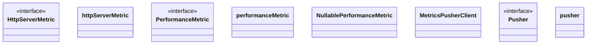

# Metrics

<!-- sdd-knowledge-generated -->

## Overview

- **Files**: 5
- **Symbols**: 34
- **Controllers**: InitHandler

## Files

- `metrics/handler.go` — InitHandler, NewMetricsServer
- `metrics/http_metrics.go` — HttpServerMetric, httpServerMetric, NewHttpServerMetric, Start, Duration, Success, ServerError, ClientError
- `metrics/metrics.go` — Collectors, PerformanceMetric, performanceMetric, NewPerformanceMetric, Start, Duration, Success, Failure, NullablePerformanceMetric, Start, Duration, Success, Failure
- `metrics/pusher.go` — MetricsPusherClient, NewMetricsPusherClient, Do, Pusher, pusher, NewPusher, NewPusherWithCustomClient, Push, Close, instanceID
- `metrics/register.go` — Register

## Architecture

### Layers

**Controller**: `InitHandler`

**Other**: `NewMetricsServer`, `HttpServerMetric`, `httpServerMetric`, `NewHttpServerMetric`, `Start`, `Duration`, `Success`, `ServerError`, `ClientError`, `Collectors`, `PerformanceMetric`, `performanceMetric`, `NewPerformanceMetric`, `Start`, `Duration`, `Success`, `Failure`, `NullablePerformanceMetric`, `Start`, `Duration`, `Success`, `Failure`, `MetricsPusherClient`, `NewMetricsPusherClient`, `Do`, `Pusher`, `pusher`, `NewPusher`, `NewPusherWithCustomClient`, `Push`, `Close`, `instanceID`, `Register`

## Class Diagram

## External Dependencies

- `github.com`

## Minimum Viable Specification

> Auto-generated specification for the **Metrics** feature.

**Key Types**: HttpServerMetric, httpServerMetric, PerformanceMetric, performanceMetric, NullablePerformanceMetric, MetricsPusherClient, Pusher, pusher

## See Also
- [call graph](../architecture/call-graph.md) <!-- rel:strong -->
- [metrics system](../architecture/metrics-system.md) <!-- rel:strong -->
- [overview](../architecture/overview.md) <!-- rel:related -->
- [models](../architecture/data/models.md) <!-- rel:related -->
- [config](../libs/config.md) <!-- rel:related -->
