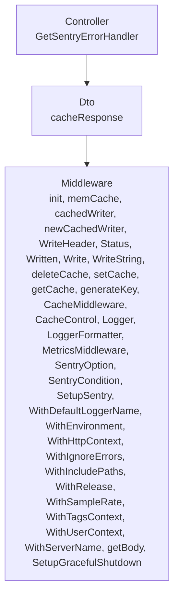
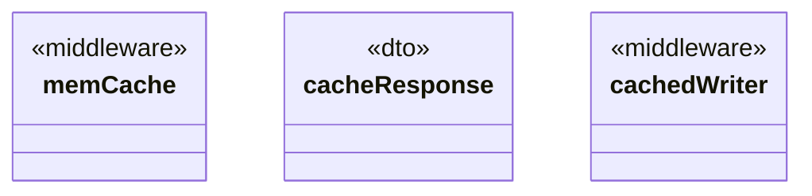

# Middleware

<!-- sdd-knowledge-generated -->

## Overview

- **Files**: 10
- **Symbols**: 35
- **DTOs**: cacheResponse
- **Controllers**: GetSentryErrorHandler

## Files

- `middleware/cache_control_test.go`
- `middleware/cache_control.go` — CacheControl
- `middleware/cache_test.go`
- `middleware/cache.go` — init, memCache, cacheResponse, cachedWriter, newCachedWriter, WriteHeader, Status, Written, Write, WriteString, deleteCache, setCache, getCache, generateKey, CacheMiddleware
- `middleware/logger.go` — Logger, LoggerFormatter
- `middleware/metrics_test.go`
- `middleware/metrics.go` — MetricsMiddleware
- `middleware/sentry_test.go`
- `middleware/sentry.go` — SentryOption, SentryCondition, SetupSentry, WithDefaultLoggerName, WithEnvironment, WithHttpContext, WithIgnoreErrors, WithIncludePaths, WithRelease, WithSampleRate, WithTagsContext, WithUserContext, WithServerName, GetSentryErrorHandler, getBody
- `middleware/shutdown.go` — SetupGracefulShutdown

## Architecture

### Layers

**Controller**: `GetSentryErrorHandler`

**Dto**: `cacheResponse`

**Middleware**: `init`, `memCache`, `cachedWriter`, `newCachedWriter`, `WriteHeader`, `Status`, `Written`, `Write`, `WriteString`, `deleteCache`, `setCache`, `getCache`, `generateKey`, `CacheMiddleware`, `CacheControl`, `Logger`, `LoggerFormatter`, `MetricsMiddleware`, `SentryOption`, `SentryCondition`, `SetupSentry`, `WithDefaultLoggerName`, `WithEnvironment`, `WithHttpContext`, `WithIgnoreErrors`, `WithIncludePaths`, `WithRelease`, `WithSampleRate`, `WithTagsContext`, `WithUserContext`, `WithServerName`, `getBody`, `SetupGracefulShutdown`

### Data Flow

## Class Diagram

## External Dependencies

- `github.com`

## Minimum Viable Specification

> Auto-generated specification for the **Middleware** feature.

**Contracts**: cacheResponse

**Key Types**: memCache, cacheResponse, cachedWriter

## See Also
- [call graph](../architecture/call-graph.md) <!-- rel:strong -->
- [overview](../architecture/overview.md) <!-- rel:related -->
- [models](../architecture/data/models.md) <!-- rel:related -->
- [middleware health bridge](../architecture/middleware-health-bridge.md) <!-- rel:related -->
- [config](../libs/config.md) <!-- rel:weak -->
