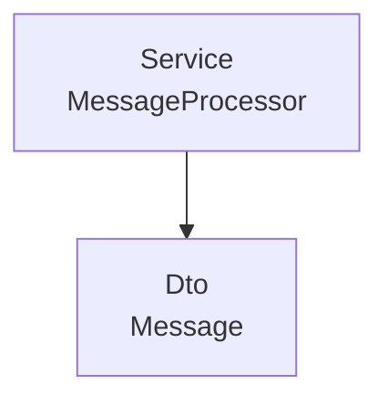
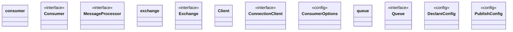

# Mq

<!-- sdd-knowledge-generated -->

## Overview

- **Files**: 5
- **Symbols**: 58
- **DTOs**: Message
- **Services**: MessageProcessor

## Files

- `mq/consumer.go` — consumer, Consumer, MessageProcessor, MessageProcessorFunc, Process, Start, Reconnect, consume, process, messageChannel, getSanitizedPrefetchCount, getRemainingRetries, HealthCheck
- `mq/exchange.go` — exchange, Exchange, Declare, Bind, BindWithKey, Publish, PublishWithKey, HealthCheck
- `mq/mq.go` — QueueName, ExchangeName, ExchangeKey, Message, Client, Option, Connect, Close, InitQueue, InitExchange, InitConsumer, StartConsumers, AddConnectionClient, ListenConnectionAsync, initNotifyCloseListeners, ListenConnection, reconnectWithRetry, reconnect, publish, publishWithConfig, ConnectionClient, HealthCheck
- `mq/options.go` — ConsumerOptions, DefaultConsumerOptions, OptionPrefetchLimit, OptionConnCheckTimeout
- `mq/queue.go` — queue, Queue, Name, Declare, DeclareWithConfig, Publish, PublishWithConfig, HealthCheck, DeclareConfig, DeliveryMode, PublishConfig

## Architecture

### Layers

**Service**: `MessageProcessor`

**Dto**: `Message`

**Config**: `publishWithConfig`, `ConsumerOptions`, `DefaultConsumerOptions`, `DeclareWithConfig`, `PublishWithConfig`, `DeclareConfig`, `PublishConfig`

**Other**: `consumer`, `Consumer`, `MessageProcessorFunc`, `Process`, `Start`, `Reconnect`, `consume`, `process`, `messageChannel`, `getSanitizedPrefetchCount`, `getRemainingRetries`, `HealthCheck`, `exchange`, `Exchange`, `Declare`, `Bind`, `BindWithKey`, `Publish`, `PublishWithKey`, `HealthCheck`, `QueueName`, `ExchangeName`, `ExchangeKey`, `Client`, `Option`, `Connect`, `Close`, `InitQueue`, `InitExchange`, `InitConsumer`, `StartConsumers`, `AddConnectionClient`, `ListenConnectionAsync`, `initNotifyCloseListeners`, `ListenConnection`, `reconnectWithRetry`, `reconnect`, `publish`, `ConnectionClient`, `HealthCheck`, `OptionPrefetchLimit`, `OptionConnCheckTimeout`, `queue`, `Queue`, `Name`, `Declare`, `Publish`, `HealthCheck`, `DeliveryMode`

### Data Flow

## Class Diagram

## External Dependencies

- `github.com`

## Minimum Viable Specification

> Auto-generated specification for the **Mq** feature.

**Contracts**: Message

**Key Types**: consumer, Consumer, MessageProcessor, exchange, Exchange, Client, ConnectionClient, ConsumerOptions, queue, Queue, DeclareConfig, PublishConfig

## See Also
- [call graph](../architecture/call-graph.md) <!-- rel:strong -->
- [models](../architecture/data/models.md) <!-- rel:related -->
- [mq pattern](../patterns/mq-pattern.md) <!-- rel:related -->
- [overview](../architecture/overview.md) <!-- rel:related -->
- [config](../libs/config.md) <!-- rel:weak -->
