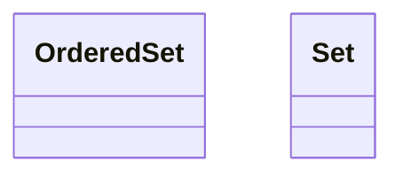

# Set

<!-- sdd-knowledge-generated -->

## Overview

- **Files**: 4
- **Symbols**: 22

## Files

- `set/ordered_test.go`
- `set/ordered.go` — OrderedSet, NewOrderedSet, Add, Contains, Values, Size, ValueAt
- `set/set_test.go`
- `set/set.go` — Set, New, NewFromValues, Add, Clear, Remove, Contains, ContainsAny, ContainsAll, Extend, Size, Values, ToSlice, MarshalJSON, UnmarshalJSON

## Class Diagram

## External Dependencies

- `github.com`

## Minimum Viable Specification

> Auto-generated specification for the **Set** feature.

**Key Types**: OrderedSet, Set

