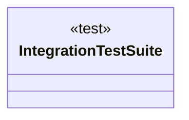

# Testy

<!-- sdd-knowledge-generated -->

## Overview

- **Files**: 3
- **Symbols**: 15

## Files

- `testy/integration_test_suite.go` — IntegrationTestSuite, GetDb, GetRedis, NewIntegrationTestDb, NewIntegrationTestRedis, MustGetTestDbDSN
- `testy/tagged_test.go`
- `testy/tagged.go` — RequireTestTag, RequireOneOfTestTags, RequireAllTestTags, runtimeTags, getRuntimeTags, parseTags, contains, containsAny, containsAll

## Class Diagram

## External Dependencies

- `github.com`
- `gorm.io`

## Minimum Viable Specification

> Auto-generated specification for the **Testy** feature.

**Key Types**: IntegrationTestSuite

## See Also
- [call graph](../architecture/call-graph.md) <!-- rel:strong -->
- [integration testing](../tests/integration-testing.md) <!-- rel:strong -->
- [config](../libs/config.md) <!-- rel:related -->
- [dependency graph](../architecture/dependency-graph.md) <!-- rel:related -->
- [overview](../architecture/overview.md) <!-- rel:weak -->
