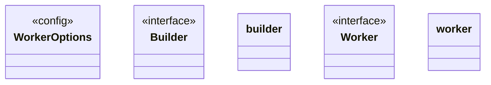
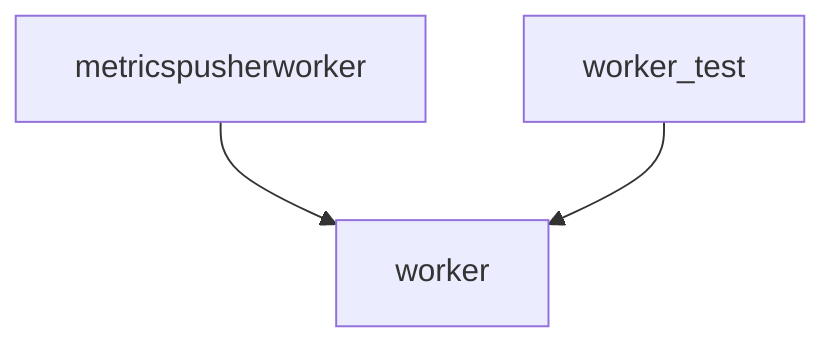

# Worker

<!-- sdd-knowledge-generated -->

## Overview

- **Files**: 4
- **Symbols**: 16

## Files

- `worker/metrics/metricspusherworker.go` — NewMetricsPusherWorker
- `worker/options.go` — WorkerOptions, DefaultWorkerOptions
- `worker/worker_test.go`
- `worker/worker.go` — Builder, builder, NewWorkerBuilder, WithOptions, WithStop, Build, Worker, worker, Name, Start, start, hold, invoke

## Architecture

### Layers

**Config**: `WorkerOptions`, `DefaultWorkerOptions`, `WithOptions`

**Other**: `NewMetricsPusherWorker`, `Builder`, `builder`, `NewWorkerBuilder`, `WithStop`, `Build`, `Worker`, `worker`, `Name`, `Start`, `start`, `hold`, `invoke`

## Class Diagram

## Internal Dependencies

## External Dependencies

- `github.com`
- `gotest.tools`

## Minimum Viable Specification

> Auto-generated specification for the **Worker** feature.

**Key Types**: WorkerOptions, Builder, builder, Worker, worker

